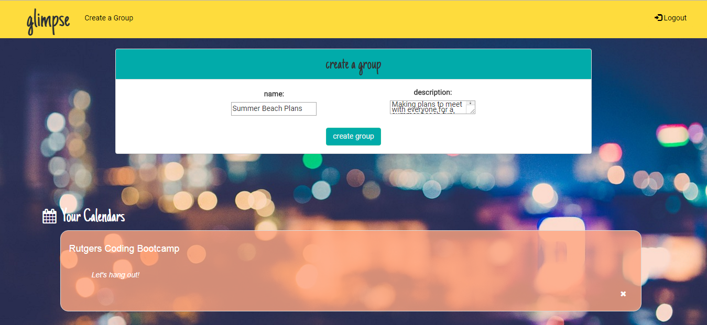
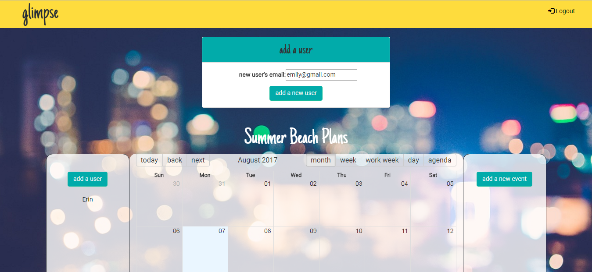
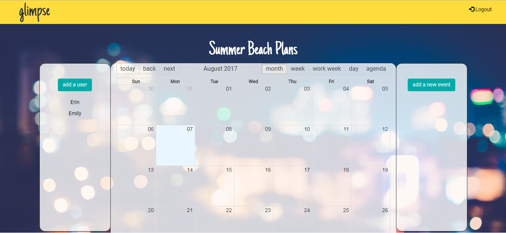
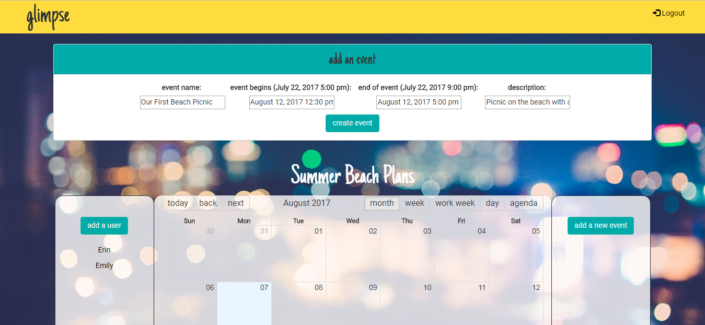
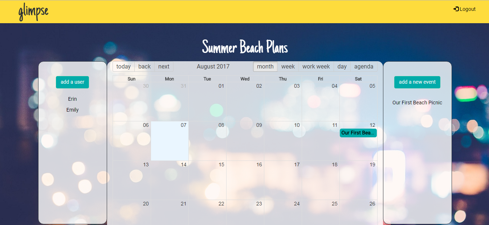
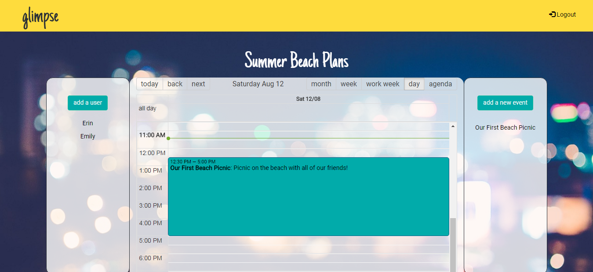
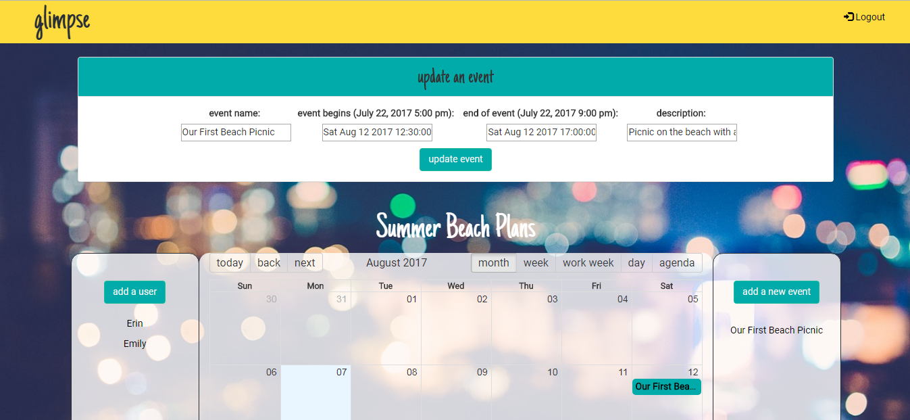

# glimpse

glimpse is a full-stack MERN application that allows users to make an account, create a shared calendar with their friends, family, or coworkers, and add all of their events to one space.

glimpse is a snapshot of the days, weeks, and months ahead and let's users see when their fellow group members are free to hang out or get away.

## Use of Application

Loading the application brings you immediately to our Landing Page which gives you a taste of what glimpse has to offer and allows you to login or sign up!

Sign up with a few simple bits of information to get started.

After signing up, you will be directed to the login page.

Once logged in, every user will be brought to their unique dashboard where they can view all the calendars they are associated with.

Creating a new group calendar is as simple as clicking the "Create a Group" button in the navbar. Once you do, a new component will render allowing you to input your group name and description.

Once you click "create group", a new calendar will be created. 

Clicking on the associated group button, brings you to its calendar dashboard page. From this page, in addition to the calendar itself, the side navigation bars will populate with all of the users associated with the calendar (on the left) as well as all of the upcoming events (on the right).

The "add a user" button is all you need to add friends, family, or coworkers to your calendar. Simply click the button, input the email address of the user you would like to add, and click "add a new user". That user will then appear in the left side navigation bar, and the calendar will appear on their personal dashboard.

The "add a new event" button makes it easy to share your events with everyone in the group. Clicking the button renders a component that requires only a few pieces of simple information. Once you click "create event", the event will appear on the calendar! 

Clicking the day of the event shows you all of it's details!

The name of the event will also render on the right side navigation bar, and clicking on it allows you to update all aspects of the event.

Clicking the Logout button in the top right corner of the Navbar on either the main Dashboard page or the Calendar page signs the user out and redirects them to the Landing Page.

## Languages and Packages Used

This application used Bootstrap 3, React, and Font Awesome on the Front End & MongoDB, Express, React Router, Node, and Passport on the Back End. 

***
Feel free to give our application a try!

Launch it [here!] and sign in using our test account:
email address: test@test.com
password: 123456

[here!]: https://glimpsecalendar.herokuapp.com/ 